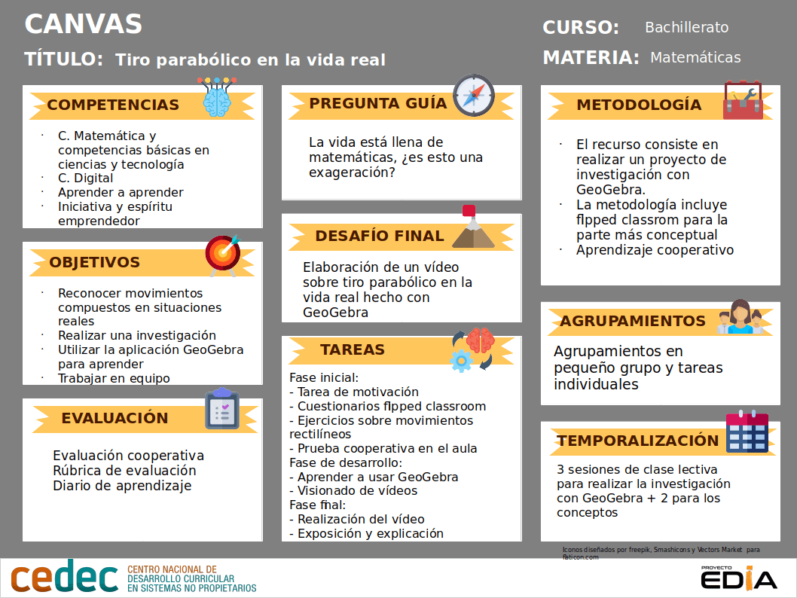

{}
Esta actividad es una adaptación del recurso original [***Tiro parabólico en la vida real***](https://cedec.intef.es/experiencias-de-exito-convertidas-en-rea-tiro-parabolico-en-la-vida-real/), elaborado por [**Juan Francisco Hernández Rodríguez**](https://twitter.com/juanfisicahr) para el [Proyecto EDIA de Cedec](https://cedec.intef.es).
{}

Esta actividad trata de determinar si el alumnado reconoce [**movimientos compuestos**]() **en situaciones reales** que le sean familiares y si aplica el principio de composición de movimientos, así como la comprensión del **carácter vectorial** de las **magnitudes**.

El alumnado, siguiendo la metodología [***flipped classroom***](https://es.wikipedia.org/wiki/Aula_invertida), visiona unos [vídeos con los contenidos fundamentales](https://descargas.intef.es/cedec/proyectoedia/matematicas/contenidos/tiro_parabolico/objetivo_y_conocimiento_previo.html) en su casa, [contestando a las preguntas que estima el profesor](https://descargas.intef.es/cedec/proyectoedia/matematicas/contenidos/tiro_parabolico/procedimiento_fase_inicial.html). En el aula se trabaja [durante tres sesiones](https://descargas.intef.es/cedec/proyectoedia/matematicas/contenidos/tiro_parabolico/procedimiento_fase_desarrollo.html) la realización de un proyecto con [**Geogebra**](https://www.geogebra.org). Finalmente, el trabajo es evaluado con la presentación de un [**vídeo**](https://descargas.intef.es/cedec/proyectoedia/matematicas/contenidos/tiro_parabolico/producto_final.html) que recoge tanto el proceso de trabajo como las conclusiones al respecto.

## Itinerario

A continuación puedes consultar el **itinerario** de aprendizaje del proyecto:

<iframe src="https://cedec.intef.es/wp-admin/admin-ajax.php?action=h5p_embed&id=13" width="100%" height="500" frameborder="0" allowfullscreen="allowfullscreen"></iframe>

El recurso se halla enriquecido con multitud de [**ejemplos** realizados en **Geogebra**](https://descargas.intef.es/cedec/proyectoedia/matematicas/contenidos/tiro_parabolico/herramienta_geogebra.html) por el profesor y por su alumnado, así como se ofrecen [**instrucciones**](https://descargas.intef.es/cedec/proyectoedia/matematicas/contenidos/tiro_parabolico/dnde_aprender_a_usar_geogebra.html), [**prácticas** de **aula**](https://descargas.intef.es/cedec/proyectoedia/matematicas/contenidos/tiro_parabolico/practicamos.html) y enlaces para aprender a utilizar esta aplicación. En [este **ejemplo** de **aula**](https://descargas.intef.es/cedec/proyectoedia/matematicas/contenidos/tiro_parabolico/ejemplo_en_un_aula.html) se desglosa la secuencia didáctica concreta que el propio Juan Francisco aplica en su aula.

## Guía didáctica

¿Quieres saber cómo se abordará la metodología [***flipped classroom***](https://es.wikipedia.org/wiki/Aula_invertida), el [**trabajo** por **proyectos**](https://es.wikipedia.org/wiki/Aprendizaje_basado_en_proyectos), el [**diario** de **aprendizaje**](https://descargas.intef.es/cedec/proyectoedia/matematicas/contenidos/tiro_parabolico/objetivo_y_conocimiento_previo.html#exe-dl-0) y la [**evaluación**](https://cedec.intef.es/rubrica/rubrica-para-evaluar-un-video-con-geogebra/) en este **proyecto**?

