Recientemente, mi tocayo [**Rodrigo González Peinado**](https://twitter.com/rodrigogpeinado) compartía en X una **curiosidad** por cada una de las **8️⃣8️⃣ constelaciones oficiales** de la [**Unión Astronómica Internacional**](https://es.wikipedia.org/wiki/Unión_Astronómica_Internacional):



{}
En esta entrada transcribimos la información que nos proporciona Rodrigo, además de añadir **fotos** de [**AlltheSky.com**](http://www.allthesky.com/constellations/visualconstellations.html) de todas las **constelaciones**, en orden alfabético.
{}

{}

## 1️⃣ Andrómeda

Hija de [Cefeo](https://es.wikipedia.org/wiki/Cefeo) y [Casiopea](https://es.wikipedia.org/wiki/Casiopea), esposa de [Perseo](https://es.wikipedia.org/wiki/Perseo) y presa de [Cetus](https://es.wikipedia.org/wiki/Ceto_(monstruo_marino)#Ceto_de_Etiopía):

.")

Da nombre al objeto más lejano visible a simple vista, la famosa [**galaxia de Andrómeda (M31)**](https://es.wikipedia.org/wiki/Galaxia_de_Andrómeda), situada a 2,5 millones de años luz, con la que colisionaremos en unos 5&thinsp;000 millones de años:

.jpg.")

## 2️⃣ Antlia (La máquina neumática)

Lo más interesante es que no tiene nada interesante, debido a su pequeño tamaño y ser bastante reciente (1751). Originalmente su nombre era "Antlia Pneumatica" hasta que [John Herschel](https://es.wikipedia.org/wiki/John_Herschel) propuso acortarlo. Alberga la galaxia satélite [Antlia 2](https://es.wikipedia.org/wiki/Antlia_2):

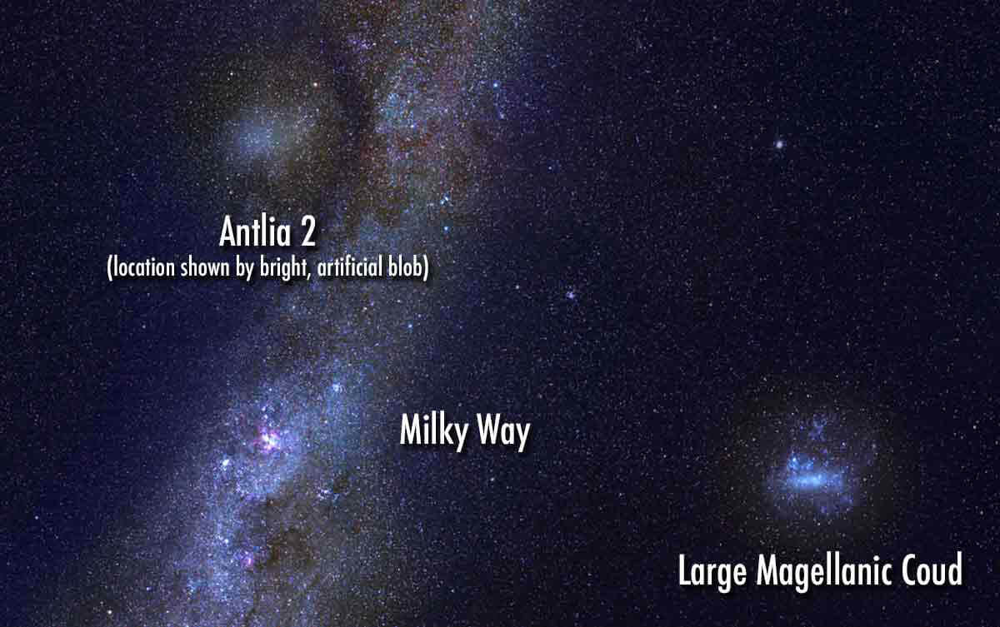

## 3️⃣ Apus (Ave del paraíso)

El nombre 'Apus' (de 'apous', sin pies en griego) hace referencia a la creencia errónea de que estas aves índicas carecían de pies. Se piensa que fue un fallo de interpretación desde el original 'Avis' (ave en griego).

## 4️⃣ Aquarius (El aguador)

Es el hogar de una de las nebulosas planetarias más conocidas, la [nebulosa de la Hélice (Helix nebula, NGC 7293)](https://es.wikipedia.org/wiki/Nebulosa_de_la_Hélice):

.jpg")

y del famoso sistema [**TRAPPIST-1**](https://es.wikipedia.org/wiki/TRAPPIST-1):

Da nombre a la ["Era de Acuario"](https://es.wikipedia.org/wiki/Era_de_Acuario), un concepto popular en [astrología](https://es.wikipedia.org/wiki/Astrología) y cultura [New Age](https://es.wikipedia.org/wiki/Nueva_era).

## 5️⃣ Aquila (El águila)

Representa a [Aetos](https://es.wikipedia.org/wiki/Águila_de_Zeus), el águila que llevaba los rayos a [Zeus](https://es.wikipedia.org/wiki/Zeus) y al que Zeus encomendó el rapto del joven [Ganimedes](https://es.wikipedia.org/wiki/Ganimedes_(mitología)) para que le sirviese como copero en el [Olimpo](https://es.wikipedia.org/wiki/Olimpo).

La sonda [Pioneer 11](https://es.wikipedia.org/wiki/Pioneer_11) pasará cerca de una de sus estrellas dentro de 4 millones de años:

## 6️⃣ Ara (El altar)

Una de sus estrellas, mu Arae, se denomina oficialmente [Cervantes](https://es.wikipedia.org/wiki/Cervantes_(estrella)), alrededor de la cual giran cuatro planetas de nombres [Quijote](https://es.wikipedia.org/wiki/Quijote_(planeta)), [Sancho](https://es.wikipedia.org/wiki/Sancho_(planeta)), [Dulcinea](https://es.wikipedia.org/wiki/Dulcinea_(planeta)) y [Rocinante](https://es.wikipedia.org/wiki/Rocinante_(planeta)), por iniciativa del [Planetario de Pamplona](https://www.pamplonetario.org), la [Sociedad Española de Astronomía](https://www.sea-astronomia.es) y el [Instituto Cervantes](https://cervantes.org):



## 7️⃣ Aries (El carnero)

Da nombre al ["punto Aries"](https://es.wikipedia.org/wiki/Punto_Aries) (o punto vernal) debido a que dicho punto se encontraba en esta constelación cuando [Hiparco](https://es.wikipedia.org/wiki/Hiparco_de_Nicea) lo definió hace más de 2&thinsp;000 años. Es un punto de vital importancia en [astronomía](https://es.wikipedia.org/wiki/Astronomía):



## 8️⃣ Auriga (El cochero)

Su representación tradicional es el primer rey de Atenas e inventor de la [cuádriga](https://es.wikipedia.org/wiki/Cuadriga), [Erictonio de Atenas](https://es.wikipedia.org/wiki/Erictonio_de_Atenas), portando la cabra [Amaltea](https://es.wikipedia.org/wiki/Amaltea_(mitología)), que simboliza la estrella más brillante de la constelación, [Capella](https://es.wikipedia.org/wiki/Capella):

.jpg")

## 9️⃣ Boötes (El pastor de bueyes)

En esta constelación se encuentra la estrella más brillante del hemisferio norte celeste, [Arturo](https://es.wikipedia.org/wiki/Arturo_(estrella)), cuyo nombre significa "guardián del oso":

## 1️⃣0️⃣ Caelum (El cincel)

Introducida por [Nicolas Louis de Lacaille](https://es.wikipedia.org/wiki/Nicolas-Louis_de_Lacaille) en el siglo XVIII, originalmente representaba un buril atado por un lazo a un estilete, si bien posteriormente se redujo a un simple cincel. No tiene gran cosa:

## 1️⃣1️⃣ Camelopardalis (La jirafa)

Es la constelación de una palabra con el nombre más largo. Contiene una de las galaxias más lejanas conocidas, [MACS0647-JD](https://es.wikipedia.org/wiki/MACS0647-JD) (*z*&thinsp;=&thinsp;10,7):

## 1️⃣2️⃣ Cancer (El cangrejo)

Da nombre al [Trópico de Cáncer](https://es.wikipedia.org/wiki/Trópico_de_Cáncer) ya que, cuando este paralelo se definió, el Sol se situaba en esta constelación en el solsticio de junio:



Es la constelación [zodiacal](https://es.wikipedia.org/wiki/Zodiaco) menos brillante.

## 1️⃣3️⃣ Canes Venatici (Los lebreles)

Su estrella más brillante se llama [Cor Caroli](https://es.wikipedia.org/wiki/Cor_Caroli), el Corazón de Carlos, en honor al rey [Carlos II de Inglaterra](https://es.wikipedia.org/wiki/Carlos_II_de_Inglaterra), que restauró la monarquía en 1660:

o a su padre, [Carlos I](https://es.wikipedia.org/wiki/Carlos_I_de_Inglaterra), que murió ejecutado:

## 1️⃣4️⃣ Canis Major (El perro mayor)

Su estrella más brillante, [Sirio](https://es.wikipedia.org/wiki/Sirio) (la estrella perro), es la estrella más brillante del cielo nocturno:

Además, su [orto helíaco](https://es.wikipedia.org/wiki/Orto_helíaco) marcaba el comienzo de la época de inundaciones del Nilo en el Antiguo Egipto:

## 1️⃣5️⃣ Canis Minor (El perro menor)

[Procyon](https://es.wikipedia.org/wiki/Procyon_(estrella)) es su estrella más brillante, cuyo nombre significa "antes del perro", ya que aparentemente sigue a [Sirio](https://es.wikipedia.org/wiki/Sirio) en el firmamento. Por ello, también recibe el nombre de Antecanis:

## 1️⃣6️⃣ Capricornus (Capricornio)

Se trata de la constelación más pequeña de entre las del [zodiaco](https://es.wikipedia.org/wiki/Zodiaco). A su vez, da nombre al [Trópico de Capricornio](https://es.wikipedia.org/wiki/Trópico_de_Capricornio) pues, cuando se definió, el Sol se situaba en esta constelación en el solsticio de diciembre:



## 1️⃣7️⃣ Carina (La quilla)

Junto con [Puppis](#68-puppis-la-popa) y [Vela](#85-vela-la-vela), formaba la ya extinta macroconstelación de [Argo Navis](https://es.wikipedia.org/wiki/Argo_Navis). Conoce la historia de esta antigua constelación en este hilo:



## 1️⃣8️⃣ Cassiopeia (Casiopea)

La esposa de [Cefeo](https://es.wikipedia.org/wiki/Cefeo). Su asterismo principal en forma de W es una alternativa a [El Carro](https://es.wikipedia.org/wiki/El_Carro_(asterismo)) para localizar [Polaris](https://es.wikipedia.org/wiki/Polaris_(estrella)) (la actual [estrella polar](https://es.wikipedia.org/wiki/Estrella_polar)) y así orientarnos en el [hemisferio norte](https://es.wikipedia.org/wiki/Hemisferio_norte).

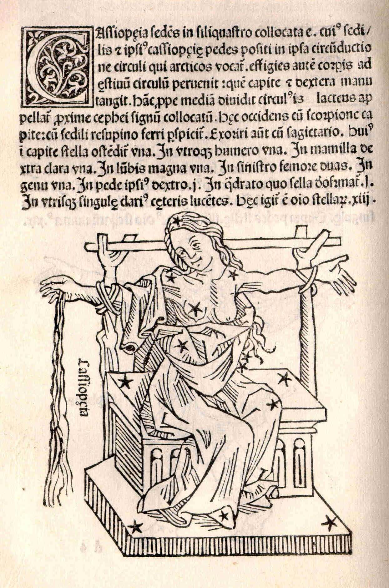

## 1️⃣9️⃣ Centaurus (El centauro)

Alberga el sistema estelar de [Alpha Centauri](https://es.wikipedia.org/wiki/Alfa_Centauri), el más cercano al Sol, con las estrellas [Alpha Centauri A](https://es.wikipedia.org/wiki/Alfa_Centauri#Alfa_Centauri_A_o_Rigil_Kentaurus), [Alpha Centauri B](https://es.wikipedia.org/wiki/Alfa_Centauri#Alfa_Centauri_B_o_Toliman) y [Próxima Centauri](https://es.wikipedia.org/wiki/Próxima_Centauri), hogar de los exoplanetas más cercanos al sistema solar:

.jpg")

## 2️⃣0️⃣ Cepheus (Cefeo)

El marido de [Casiopea](https://es.wikipedia.org/wiki/Casiopea):

Su estrella [Delta Cephei](https://es.wikipedia.org/wiki/Delta_Cephei) es el prototipo de las [estrellas variables cefeidas](https://es.wikipedia.org/wiki/Estrella_variable_Cefeida), un tipo de [candela estándar](https://es.wikipedia.org/wiki/Candela_estándar) de capital importancia en el cálculo de distancias extragalácticas:

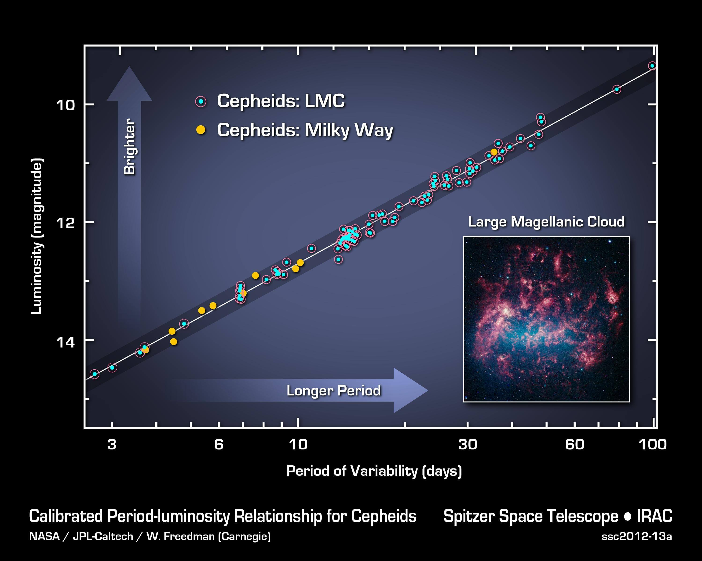

## 2️⃣1️⃣ Cetus (La ballena)

Si bien no es una constelación zodiacal (la eclíptica no pasa por ella), es posible encontrar a la Luna y a los planetas en ella. En ella también se encuentra la galaxia [Messier 77](https://es.wikipedia.org/wiki/Galaxia_espiral_M77):

## 2️⃣2️⃣ Chamaeleon (El camaleón)

En dos milenios, su estrella [Gamma Chamaeleontis](https://es.wikipedia.org/wiki/Gamma_Chamaeleontis) será la [estrella polar austral](https://es.wikipedia.org/wiki/Estrella_del_Sur_(astronomía)), es decir, la más cercana al [Polo Sur Celeste](https://es.wikipedia.org/wiki/Polo_celeste):

## 2️⃣3️⃣ Circinus (El compás)

En el año 185, los astrónomos chinos observaron en ella una [supernova](https://es.wikipedia.org/wiki/Supernova), conocida ahora como [SN 185](https://es.wikipedia.org/wiki/SN_185). Es la primera supernova de la que se tiene registro indudable:

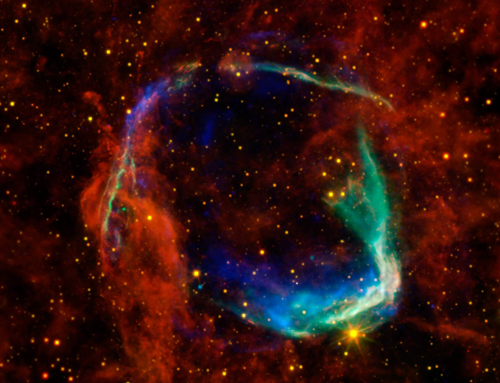

## 2️⃣4️⃣ Columba (La paloma)

Esta constelación alberga el [antápex solar](https://es.wikipedia.org/wiki/Ápex_solar), es decir, el punto celeste del cual el Sistema Solar parece alejarse con respecto al sistema de reposo local:

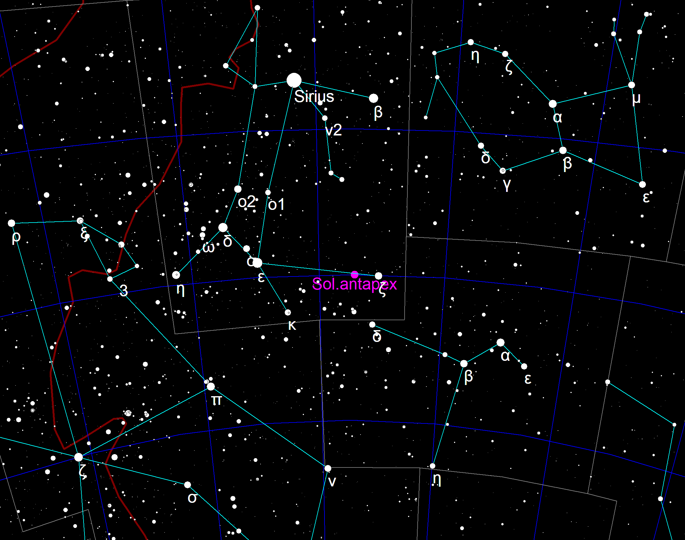

## 2️⃣5️⃣ Coma Berenices (La cabellera de Berenice)

Es la única constelación que recibe su nombre de un personaje histórico, [Berenice II de Egipto](https://es.wikipedia.org/wiki/Berenice_II_de_Egipto), la cual se cortó su melena en ofrenda para que su marido [Ptolomeo III](https://es.wikipedia.org/wiki/Ptolomeo_III) volviese victorioso de la guerra:

## 2️⃣6️⃣ Corona Australis (La corona austral)

Se trata de la contrapartida de la constelación [Corona Borealis](#27-corona-borealis-la-corona-boreal). En ella se localiza la [Nube Molecular de Corona Australis](https://es.wikipedia.org/wiki/Corona_Australis#Nube_Molecular_de_la_Corona_Australis), una de las regiones de formación estelar más cercanas a la Tierra:

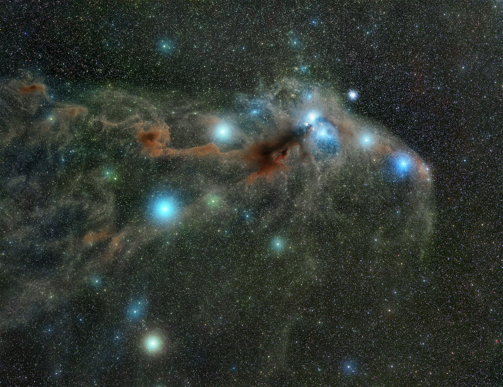

## 2️⃣7️⃣ Corona Borealis (La corona boreal)

Se trata de la contrapartida de la constelación [Corona Australis](#26-corona-australis-la-corona-austral). Representa la corona que [Dioniso](https://es.wikipedia.org/wiki/Dioniso) le regaló a [Ariadna](https://es.wikipedia.org/wiki/Ariadna), hija del rey [Minos](https://es.wikipedia.org/wiki/Minos):

## 2️⃣8️⃣ Corvus (El cuervo)

En colaboración con [DC Comics](https://es.wikipedia.org/wiki/DC_Comics), [Neil deGrasse Tyson](https://twitter.com/neiltyson) propuso que el planeta de [Superman](https://es.wikipedia.org/wiki/Superman), [Krypton](https://es.wikipedia.org/wiki/Krypton), orbitara la estrella [LHS 2520](https://en.wikipedia.org/wiki/LHS_2520), una enana roja en esta constelación:

## 2️⃣9️⃣ Crater (La copa)

Contiene una galaxia enana satélite de la [Vía Láctea](https://es.wikipedia.org/wiki/Vía_Láctea), [Crater 2](https://es.wikipedia.org/wiki/Enana_de_Crater_2), descubierta en 2016. Se trata de la cuarta galaxia satélite más grande, aunque de las menos brillantes:

## 3️⃣0️⃣ Crux (La cruz)

Es la constelación más pequeña del [firmamento](https://es.wikipedia.org/wiki/Firmamento). El asterismo conocido como [Cruz del Sur](https://es.wikipedia.org/wiki/Crux) se usa habitualmente como guía para localizar la estrella polar austral, [Sigma Octantis](https://es.wikipedia.org/wiki/Polaris_Australis). Aparece en multitud de banderas australes:

## 3️⃣1️⃣ Cygnus (El cisne)

Se trata de la constelación con más exoplanetas descubiertos, gracias a la [misión Kepler](https://es.wikipedia.org/wiki/Kepler_(telescopio_espacial)):

Su estrella más brillante, [Deneb](https://es.wikipedia.org/wiki/Deneb), es una gigante blanco azulada que es la estrella más lejana de primera magnitud:

## 3️⃣2️⃣ Delphinus (El delfín)

Sus dos estrellas más brillantes, [Rotanev](https://es.wikipedia.org/wiki/Rotanev) y [Sualocin](https://es.wikipedia.org/wiki/Sualocin), esconden un juego de palabras muy curioso que Rodrigo explicó en su primer hilo de Twitter:



## 3️⃣3️⃣ Dorado (La dorada)

La mayor parte de la [Gran Nube de Magallanes](https://es.wikipedia.org/wiki/Gran_Nube_de_Magallanes), la galaxia irregular [satélite](https://es.wikipedia.org/wiki/Galaxia_satélite) de la [Vía Láctea](https://es.wikipedia.org/wiki/Vía_Láctea) más grande y visible a simple vista desde el hemisferio sur, se ubica en esta constelación:

## 3️⃣4️⃣ Draco (El dragón)

Es una constelación [circumpolar](https://es.wikipedia.org/wiki/Estrella_circumpolar) boreal (siempre visible desde el hemisferio norte) que alberga la estrella [Thuban](https://es.wikipedia.org/wiki/Thuban), la cual fue la estrella polar boreal durante la época de los antiguos egipcios:

## 3️⃣5️⃣ Equuleus (El caballo)

Es la constelación más pequeña del hemisferio norte y la segunda más pequeña de todo el firmamento. Debido a su pequeño tamaño, no posee objetos demasiado importantes.

## 3️⃣6️⃣ Eridanus (El eridano)

Se trata de la constelación que más abarca en dirección norte-sur. Su estrella más brillante, [Achernar](https://es.wikipedia.org/wiki/Achernar), presenta una forma ovalada debido a su rápida rotación:

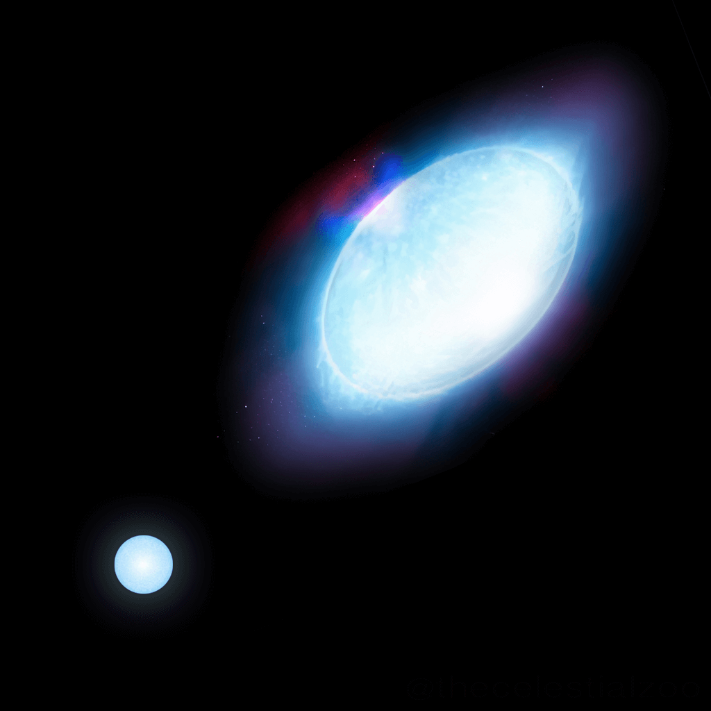

## 3️⃣7️⃣ Fornax (El horno)

El [Campo ultraprofundo del Hubble](https://es.wikipedia.org/wiki/Campo_ultraprofundo_del_Hubble) (HUDF por sus siglas en inglés) se sitúa en esta constelación. Se trata de una imagen de vital importancia en el estudio de la formación y evolución de las galaxias en el universo joven:

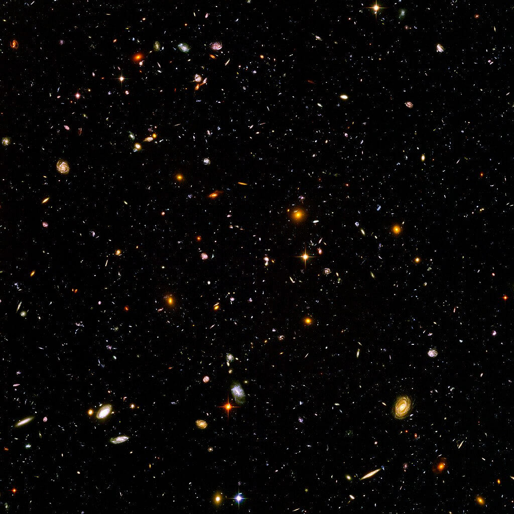

## 3️⃣8️⃣ Gemini (Los gemelos)

El nombre hace referencia a los gemelos de la mitología griega [Cástor y Pólux](https://es.wikipedia.org/wiki/Dioscuros), que son a la vez los nombres de sus dos estrellas más brillantes. Tanto [Urano](https://es.wikipedia.org/wiki/Urano_(planeta)) (1781) como [Plutón](https://es.wikipedia.org/wiki/Plutón_(planeta_enano)) (1930) se descubrieron en [Gemini](https://es.wikipedia.org/wiki/Géminis_(constelación)):

_-_JPEG_converted.jpg.")

## 3️⃣9️⃣ Grus (La grulla)

El cuarteto de la [Grulla](https://es.wikipedia.org/wiki/Grus_(constelación)) es un conjunto de cuatro [galaxias espirales](https://es.wikipedia.org/wiki/Galaxia_espiral) en interacción situado en esta constelación. Las tres más cercanas entre sí se conocen conjuntamente como el triplete de la Grulla:

## 4️⃣0️⃣ Hercules (Hércules)

En ella se encuentra el [cúmulo globular](https://es.wikipedia.org/wiki/Cúmulo_globular) [Messier 13](https://es.wikipedia.org/wiki/Cúmulo_de_Hércules), uno de los cúmulos globulares más conocidos y hacia el que en 1974 se envió el famoso [mensaje de Arecibo](https://es.wikipedia.org/wiki/Mensaje_de_Arecibo), el cual llegará al cúmulo en unos 22&thinsp;000 años:



## 4️⃣1️⃣ Horologium (El reloj)

Alberga al cúmulo globular [Arp-Madore 1](https://en.wikipedia.org/wiki/Arp-Madore_1), el segundo más lejano de la [Vía Láctea](https://es.wikipedia.org/wiki/Vía_Láctea), y parte del [supercúmulo](https://es.wikipedia.org/wiki/Supercúmulo) de galaxias [Hologorium-Reticulum](https://en.wikipedia.org/wiki/Horologium-Reticulum_Supercluster), el segundo supercúmulo más extenso en el universo local:

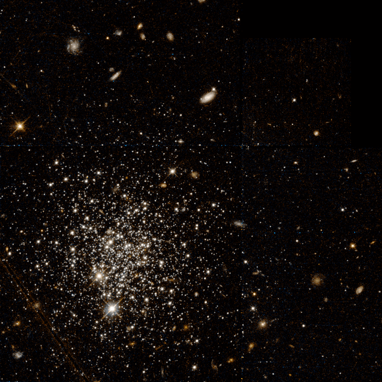

## 4️⃣2️⃣ Hydra (La hidra)

Se trata de la constelación más grande de todo el firmamento, ocupando 1303 grados cuadrados del cielo, lo que representa un 3,16&thinsp;% del mismo. En ella se encuentra la famosa galaxia espiral [Messier 83](https://es.wikipedia.org/wiki/Molinillo_Austral):

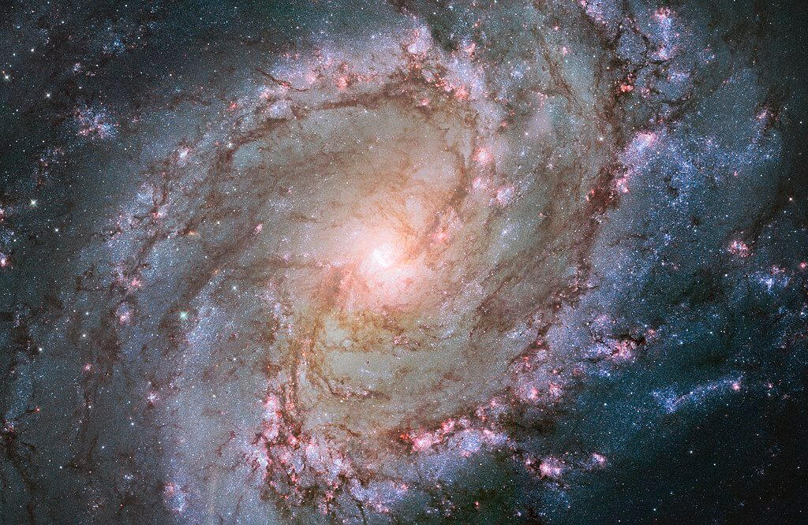

## 4️⃣3️⃣ Hydrus (La hidra macho)

Es la versión pequeña de la anterior. [Herman Melville](https://es.wikipedia.org/wiki/Herman_Melville) la nombra, junto con [Volans](#87-volans-el-pez-volador), en su novela [Moby Dick](https://es.wikipedia.org/wiki/Moby_Dick):

## 4️⃣4️⃣ Indus (El indio)

Es la única constelación bautizada en honor a un pueblo o persona. En 2015 se detectó un evento extremadamente luminoso de nombre [ASASSN-15lh](https://es.wikipedia.org/wiki/ASASSN-15lh), si bien su naturaleza no está aún aclarada:

## 4️⃣5️⃣ Lacerta (El lagarto)

Su asterismo principal presenta una forma de W similar a [Casiopea](#18-cassiopeia-casiopea), por lo que también se la conoce como "la pequeña Casiopea". El carguero estadounidense de la Segunda Guerra Mundial, el [USS Lacerta](https://en.wikipedia.org/wiki/USS_Lacerta), recibió su nombre de esta constelación:

_underway,_circa_in_1945.jpg")

## 4️⃣6️⃣ Leo (El león)

Hace referencia al [león de Nemea](https://es.wikipedia.org/wiki/León_de_Nemea), uno de los doce trabajos de [Heracles](https://es.wikipedia.org/wiki/Heracles). Alberga el llamado [triplete de Leo](https://es.wikipedia.org/wiki/Triplete_de_Leo), tres galaxias espirales muy conocidas entre los aficionados a la astronomía:

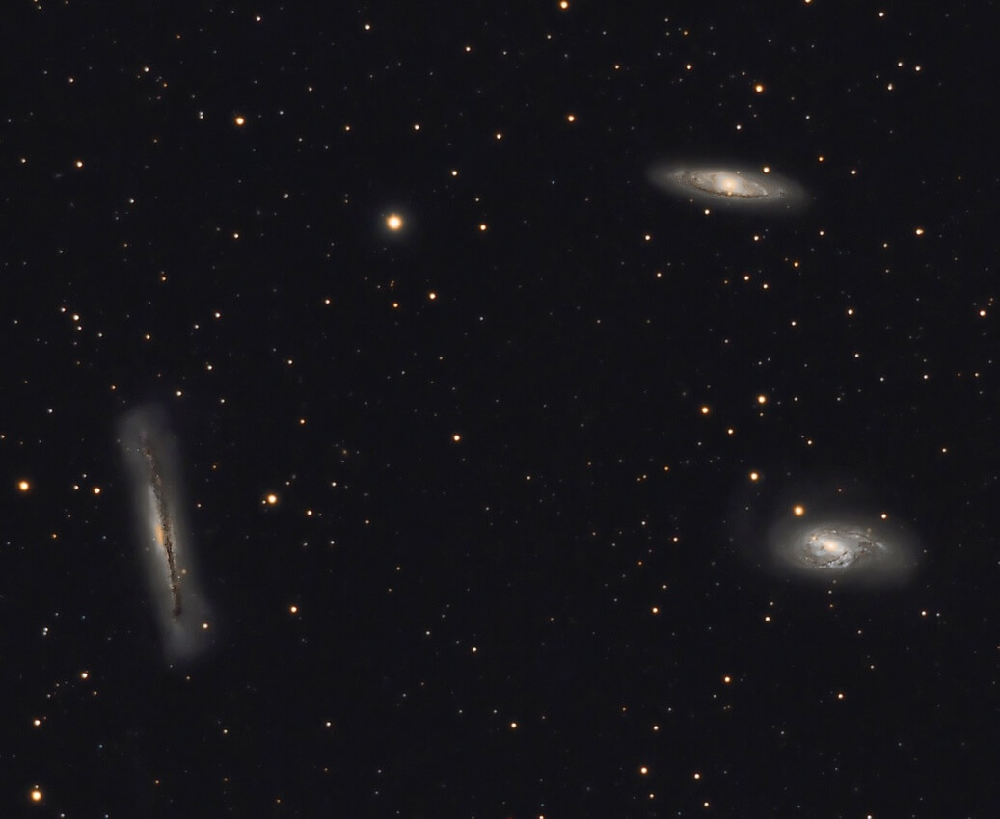

## 4️⃣7️⃣ Leo Minor (El león menor)

Es la única constelación que no tiene ninguna estrella designada con la letra 'alpha' en la [denominación de Bayer](https://es.wikipedia.org/wiki/Denominación_de_Bayer), posiblemente debido a un error del astrónomo [Francis Baily](https://es.wikipedia.org/wiki/Francis_Baily).

## 4️⃣8️⃣ Lepus (La liebre)

Situada cerca de [Orion](https://es.wikipedia.org/wiki/Orión_(constelación)) y los dos perros ([Canis Major](#14-canis-major-el-perro-mayor) y [Minor](#15-canis-minor-el-perro-menor)), se suele interpretar como la presa de ambos perros. Alberga el [cúmulo globular Messier 79](https://es.wikipedia.org/wiki/Cúmulo_globular_M79) que, junto con [Messier 54](https://es.wikipedia.org/wiki/Cúmulo_globular_M54), son los únicos cúmulos extragalácticos del [*Catálogo Messier*](https://es.wikipedia.org/wiki/Catálogo_Messier):

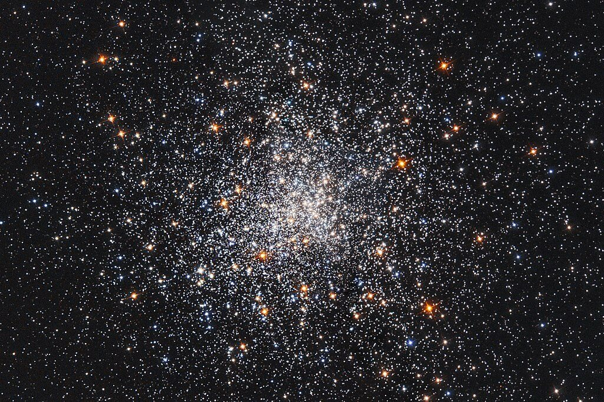

## 4️⃣9️⃣ Libra (La balanza)

Originalmente parte de [Scorpius](), se trata de la única constelación [zodiacal](https://es.wikipedia.org/wiki/Zodiaco) que no tiene forma de animal. Da nombre al [punto libra o segundo punto Aries](https://es.wikipedia.org/wiki/Punto_Libra), el punto diametralmente opuesto al [punto Aries](https://es.wikipedia.org/wiki/Punto_Aries):



## 5️⃣0️⃣ Lupus (El lobo)

Alberga una supernova histórica, que tuvo lugar el 1 de mayo de 1006 y que fue captada por astrónomos a lo largo de Europa y Asia. Es la supernova observada más brillante de la historia:

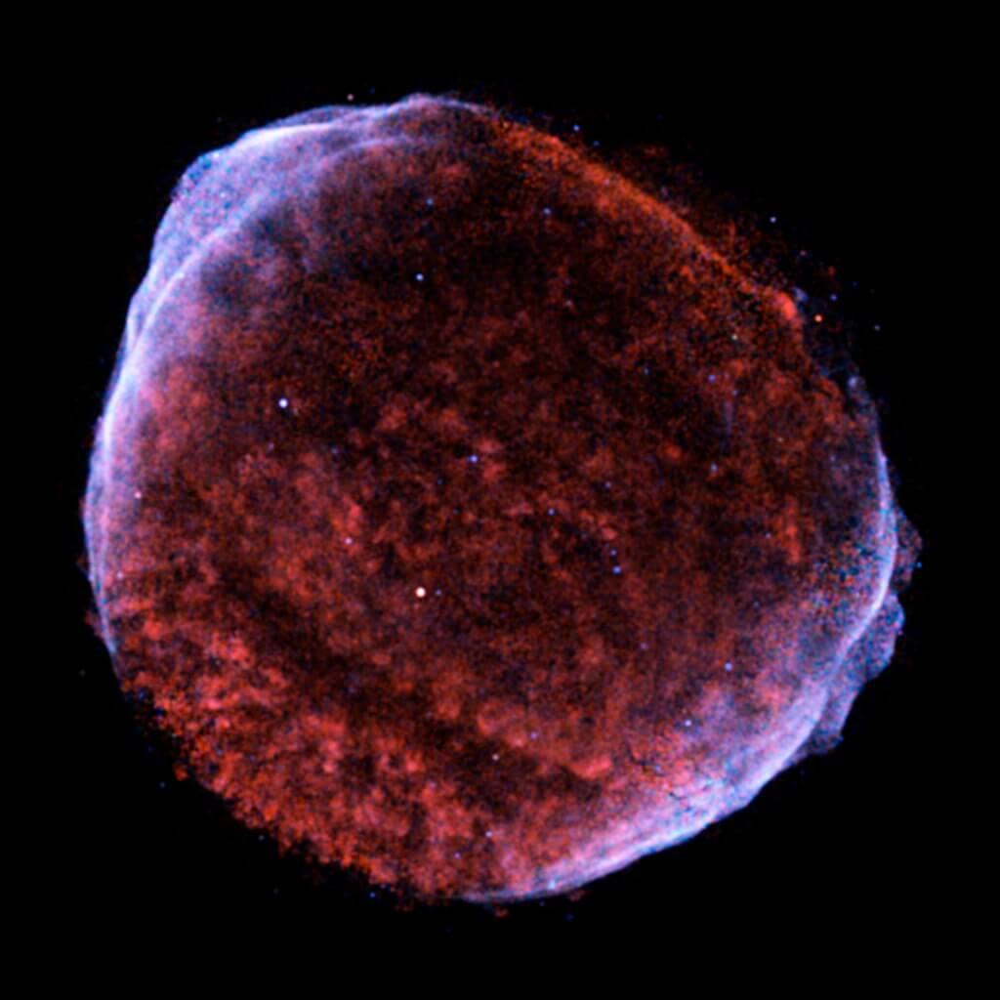

## 5️⃣1️⃣ Lynx (El lince)

Su nombre se debe a que el creador de esta constelación, [Johannes Hevelius](https://es.wikipedia.org/wiki/Johannes_Hevelius), escribió que "*habría que tener los ojos de un lince para observarla*", debido a la poca abundancia de estrellas brillantes.

## 5️⃣2️⃣ Lyra (La lira)

Su estrella más brillante es [Vega](https://es.wikipedia.org/wiki/Vega_(estrella)), que históricamente se ha usado como 'punto cero' de calibración para el resto de estrellas. Por ello, es una de las estrellas más importantes del firmamento y la más brillante del [triángulo del verano](https://es.wikipedia.org/wiki/Triángulo_de_verano):

## 5️⃣3️⃣ Mensa (La mesa)

Su nombre hace referencia a la [Montaña de la Mesa](https://es.wikipedia.org/wiki/Montaña_de_la_Mesa) en [Sudáfrica](https://es.wikipedia.org/wiki/Sudáfrica):

Su estrella más brillante es [Alpha Mensae](https://es.wikipedia.org/wiki/Alfa_Mensae), que es la estrella más débil de entre las más brillantes de cada constelación.

## 5️⃣4️⃣ Microscopium (El microscopio)

El astrónomo y comunicador inglés [Patrick Moore](https://es.wikipedia.org/wiki/Patrick_Moore) la catalogó como "*totalmente irrelevante*" a la hora de observar objetos. No le faltaba razón.

Posee la primera y más brillante enana M descubierta, [Lacaille 8760](https://es.wikipedia.org/wiki/Lacaille_8760).

## 5️⃣5️⃣ Monoceros (El unicornio)

Contiene a la espectacular [nebulosa Roseta](https://es.wikipedia.org/wiki/Nebulosa_Roseta) (entre otros objetos de cielo profundo) y el agujero negro [1A 0620–00](https://es.wikipedia.org/wiki/A0620-00), al que en 2018 la [ESA](https://es.wikipedia.org/wiki/Agencia_Espacial_Europea) envió desde [Cebreros](https://es.wikipedia.org/wiki/Estación_de_Cebreros) un mensaje de [Hawking](https://es.wikipedia.org/wiki/Stephen_Hawking) como homenaje tras su fallecimiento.

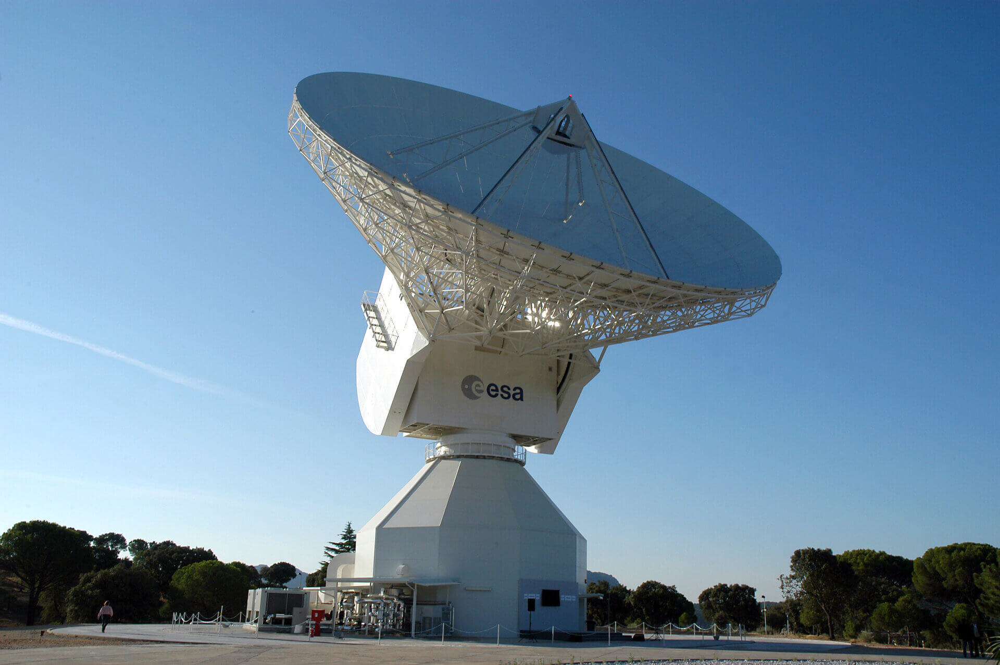

## 5️⃣6️⃣ Musca (La mosca)

Originalmente se llamó [Apis](https://es.wikipedia.org/wiki/Apis_(constelación)) (abeja en latín), nombre que se mantuvo durante 200 años antes de que [Lacaille](https://es.wikipedia.org/wiki/Nicolas-Louis_de_Lacaille) cambiase su nombre para evitar confusión con [Apus](#3-apus-ave-del-paraíso). Es la única constelación que representa un insecto.

## 5️⃣7️⃣ Norma (La escuadra)

Alberga a la famosa nebulosa planetaria Mz 3, conocida como la [nebulosa de la Hormiga](https://es.wikipedia.org/wiki/Nebulosa_de_la_Hormiga):

La constelación es atravesada por la [Vía Láctea](https://es.wikipedia.org/wiki/Vía_Láctea) y [da nombre a uno de sus brazos menores](https://es.wikipedia.org/wiki/Brazo_de_Norma):

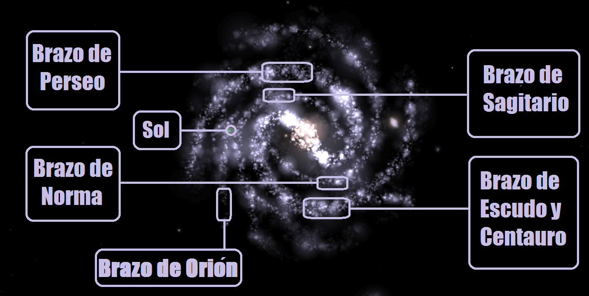

## 5️⃣8️⃣ Octans (El octante)

Se trata de la constelación más austral de todas. En ella se halla la estrella [Sigma Octantis](https://es.wikipedia.org/wiki/Polaris_Australis), que es actualmente la estrella polar del hemisferio sur y, por tanto, nos indica dónde está el punto cardinal sur.

## 5️⃣9️⃣ Ophiuchus (El serpentario)

Es una de las [13 constelaciones zodiacales](https://es.wikipedia.org/wiki/Ofiuco_(astrología)) y la única que no posee signo zodiacal propio. Aparece sosteniendo a la constelación de [Serpens](#76-serpens-la-serpiente), a la cual divide en dos:

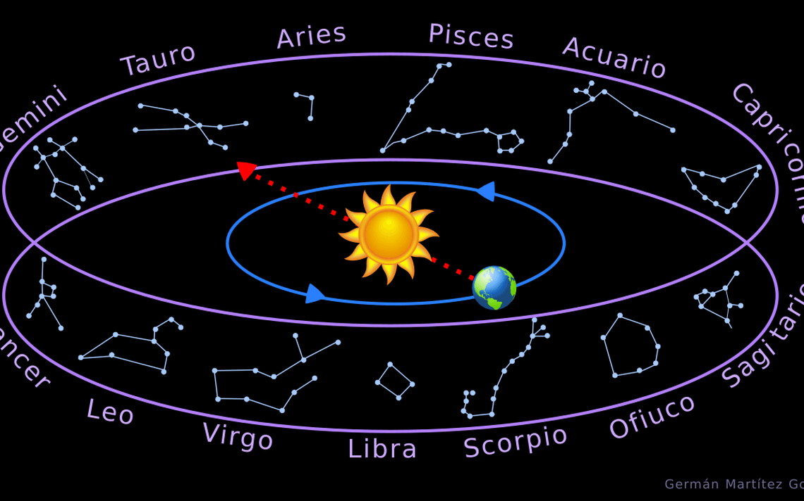

El agujero negro más cercano a la Tierra ([Gaia BH1](https://en.wikipedia.org/wiki/Gaia_BH1)) está en esta constelación:

## 6️⃣0️⃣ Orion (El cazador)

Posiblemente la constelación más famosa por su característica forma. Alberga la conocidísima [nebulosa de Orión](https://es.wikipedia.org/wiki/Nebulosa_de_Orión), la región de formación estelar más cercana a la Tierra y la más estudiada. Orion se merece una entrada entera para ella sola.

## 6️⃣1️⃣ Pavo (El pavo)

Su nombre no hace referencia al [pavo real común o indio](https://es.wikipedia.org/wiki/Pavo_cristatus), sino al [pavo real cuelliverde](https://es.wikipedia.org/wiki/Pavo_muticus), endémico del sudeste asiático:

Es la única constelación cuya estrella principal ([Peacock](https://es.wikipedia.org/wiki/Peacock_(estrella))) se llama igual en inglés que el ser al que representa.

## 6️⃣2️⃣ Pegasus (Pegaso)

En esta constelación los astrónomos [Michel Mayor](https://es.wikipedia.org/wiki/Michel_Mayor) y [Didier Queloz](https://es.wikipedia.org/wiki/Didier_Queloz) descubrieron en 1995 el primer exoplaneta alrededor de una estrella similar al Sol, [51 Pegasi b](https://es.wikipedia.org/wiki/Dimidio):

Fueron galardonados con el [Premio Nobel de Física en 2019](https://www.nobelprize.org/prizes/physics/2019/summary/) por dicho hallazgo:

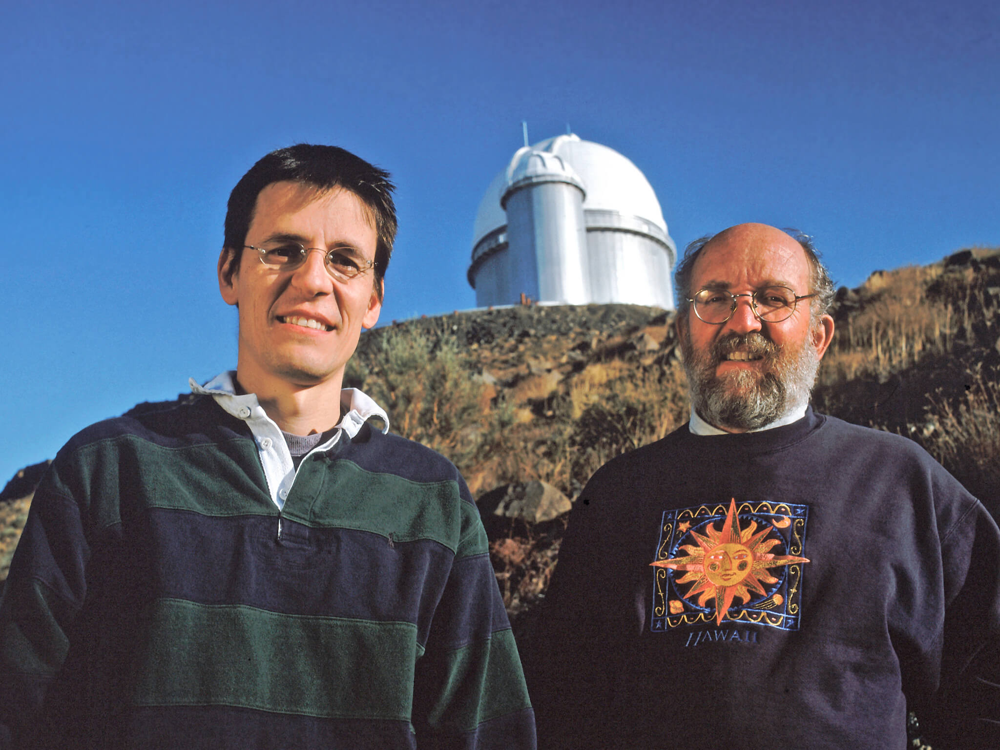

## 6️⃣3️⃣ Perseus (Perseo)

Da nombre a la lluvia de meteoros más famosa de todas, las [Perseidas](https://es.wikipedia.org/wiki/Perseidas), aunque su [radiante](https://es.wikipedia.org/wiki/Radiante) se localiza en [Cassiopeia](#18-cassiopeia-casiopea):

")

En [Futurama](https://es.wikipedia.org/wiki/Futurama), la estrella [Omicron Persei](https://futurama.fandom.com/es/wiki/Omicron_Persei) posee a su alrededor un exoplaneta, [Omicron Persei 8](https://futurama.fandom.com/es/wiki/Omicron_Persei_8), el hogar de los [omicronianos](https://futurama.fandom.com/es/wiki/Omicronianos):

## 6️⃣4️⃣ Phoenix (El fénix)

En esta constelación se encuentra el agujero negro más grande conocido. Recibe el nombre de [Phoenix A](https://es.wikipedia.org/wiki/Cúmulo_de_Phoenix#Agujero_negro_supermasivo) y posee una masa 24&thinsp;000 veces superior al agujero negro del centro de nuestra galaxia:

## 6️⃣5️⃣ Pictor (El caballete)

Es conocida por una de sus estrellas, [Beta Pictoris](https://es.wikipedia.org/wiki/Beta_Pictoris), que bautiza a un grupo de movimiento propio de estrellas. Fue la primera estrella en la que se observó un [disco circunestelar](https://es.wikipedia.org/wiki/Disco_circunestelar), en 1984:

## 6️⃣6️⃣ Pisces (Los peces)

Debido a la [precesión de los equinoccios](https://es.wikipedia.org/wiki/Precesión_de_los_equinoccios), actualmente el [punto Aries](https://es.wikipedia.org/wiki/Punto_Aries) se sitúa en esta constelación. En relación a su tamaño, es la constelación [zodiacal](https://es.wikipedia.org/wiki/Zodiaco) menos brillante.

## 6️⃣7️⃣ Piscis Austrinus (El pez austral)

Posee una de las estrellas más famosas entre los astrofísicos, [Fomalhaut](https://es.wikipedia.org/wiki/Fomalhaut), por el espectacular [disco circunestelar](https://es.wikipedia.org/wiki/Disco_circunestelar) que la rodea. De hecho, también se la conoce como 'El ojo de Sauron':

## 6️⃣8️⃣ Puppis (La popa)

Es otra de la constelaciones que formaban la ya extinta constelación [Argo Navis](https://es.wikipedia.org/wiki/Argo_Navis), junto con [Carina](#17-carina-la-quilla) y [Vela](#85-vela-la-vela). Es la más grande de las tres:

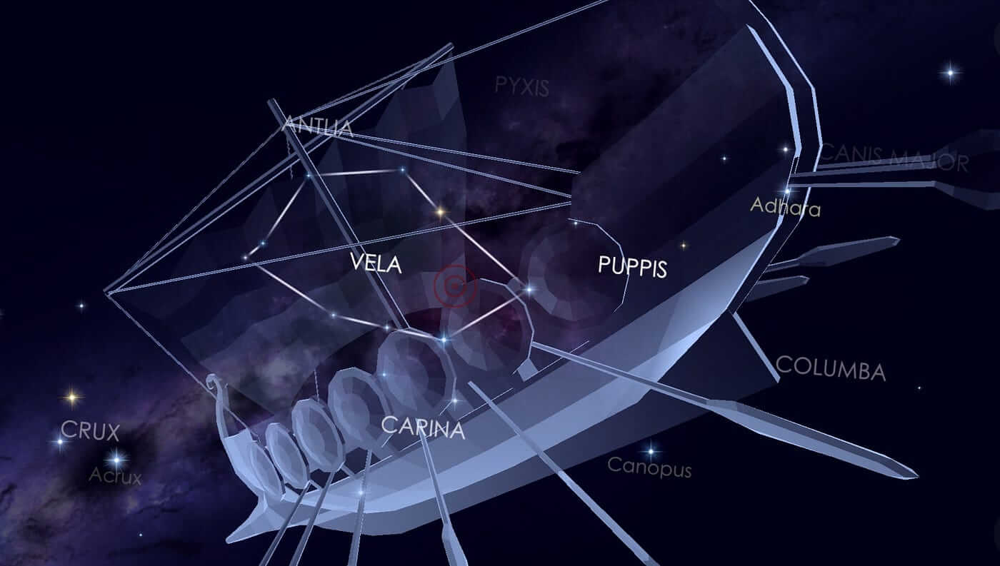

## 6️⃣9️⃣ Pyxis (La brújula)

[John Herschel](https://es.wikipedia.org/wiki/John_Herschel) propuso cambiar su denominación a [Malus (El mástil)](https://es.wikipedia.org/wiki/Malus_(constelación)), por estar pegada a [Argo Navis](https://es.wikipedia.org/wiki/Argo_Navis). Finalmente, el nombre no cuajó.

## 7️⃣0️⃣ Reticulum (El retículo)

Su estrella [Zeta Reticuli](https://es.wikipedia.org/wiki/Zeta_Reticuli) se hizo famosa por, según algunas investigaciones, ser la estrella de la que vinieron unos extraterrestres que abdujeron a [Betty y Barney Hill](https://es.wikipedia.org/wiki/Betty_y_Barney_Hill) en 1961 en lo que se conoció como "la abducción de los Hill":

## 7️⃣1️⃣ Sagitta (La flecha)

Lo más importante de esta constelación es no confundirla con [Sagittarius](#72-sagittarius-sagitario). Alberga el [cúmulo globular M71](https://es.wikipedia.org/wiki/Cúmulo_globular_M71), posiblemente el cúmulo más soso del [*Catálogo Messier*](https://es.wikipedia.org/wiki/Catálogo_Messier) al telescopio:

## 7️⃣2️⃣ Sagittarius (Sagitario)

El asterismo central recibe el nombre de 'La tetera' por su característica forma. En dirección de esta constelación desde la Tierra se halla el centro de la [Vía Láctea](https://es.wikipedia.org/wiki/Vía_Láctea), un [agujero negro supermasivo](https://es.wikipedia.org/wiki/Agujero_negro_supermasivo) de nombre [Sagittarius A*](https://es.wikipedia.org/wiki/Sagitario_A*):

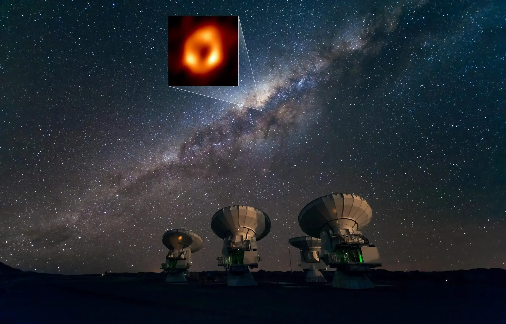

## 7️⃣3️⃣ Scorpius (El escorpión)

Se trata de la constelación [zodiacal](https://es.wikipedia.org/wiki/Zodiaco) en la que el Sol pasa menos tiempo. Su estrella más brillante es [Antares](https://es.wikipedia.org/wiki/Antares), cuyo nombre significa "el rival de [Ares](https://es.wikipedia.org/wiki/Ares)", por rivalizar en color rojo con el planeta [Marte](https://es.wikipedia.org/wiki/Marte_(planeta)):

## 7️⃣4️⃣ Sculptor (El escultor)

El [polo sur galáctico](https://es.wikipedia.org/wiki/Plano_galáctico) se encuentra en esta constelación. También contiene a la [enana del Escultor](https://es.wikipedia.org/wiki/Enana_de_Sculptor) (una galaxia satélite de la Vía Láctea) y la famosa [galaxia Rueda de Carro](https://es.wikipedia.org/wiki/Galaxia_Rueda_de_Carro):

_(weic2211a).jpeg.")

## 7️⃣5️⃣ Scutum (El escudo)

Es el hogar de [UY Scuti](https://es.wikipedia.org/wiki/UY_Scuti), una de las estrellas que siempre disputa el papel de estrella más grande descubierta:

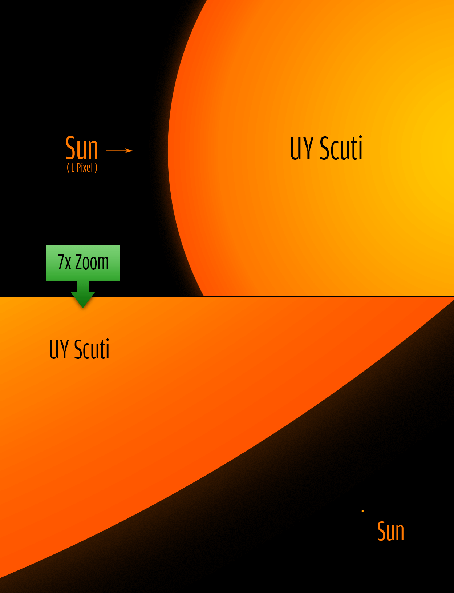

La sonda [Pioneer 11](https://es.wikipedia.org/wiki/Pioneer_11) está actualmente viajando en la dirección de esta constelación:

## 7️⃣6️⃣ Serpens (La serpiente)

Es la única constelación que está dividida en dos partes, Serpens Caput (la cabeza):

y Serpens Cauda (la cola):

Alberga una de las nebulosas más famosas: la [nebulosa del Águila (Messier 16)](https://es.wikipedia.org/wiki/Nebulosa_del_Águila), donde se sitúan los [Pilares de la Creación](https://es.wikipedia.org/wiki/Pilares_de_la_Creación):

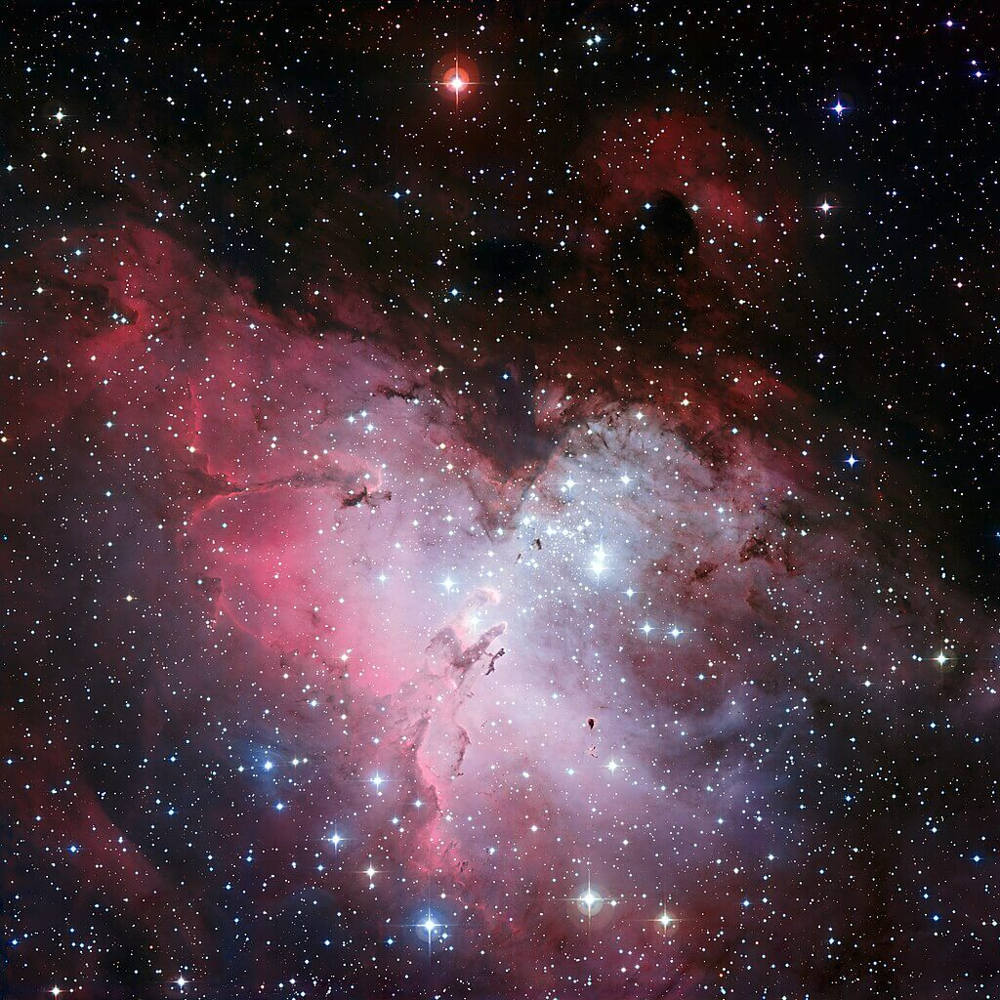

## 7️⃣7️⃣ Sextans (El sextante)

El [Telescopio Espacial Hubble](https://es.wikipedia.org/wiki/Telescopio_espacial_Hubble) eligió un área de esta constelación para su [Cosmic Evolution Survey (COSMOS)](https://en.wikipedia.org/wiki/Cosmic_Evolution_Survey), que publicó el primer mapa 3D de la [materia oscura](https://es.wikipedia.org/wiki/Materia_oscura), entre otros logros:

## 7️⃣8️⃣ Taurus (El toro)

Otra de las constelaciones más fáciles de identificar, siempre en lucha contra [Orión](#60-orion-el-cazador). En ella se encuentra el [cúmulo abierto](https://es.wikipedia.org/wiki/Cúmulo_abierto) más cercano a la Tierra, las [Híades](https://es.wikipedia.org/wiki/Híades_(astronomía)), así como el más conocido, las [Pléyades](https://es.wikipedia.org/wiki/Pléyades_(astronomía)):

## 7️⃣9️⃣ Telescopium (El telescopio)

Durante la friolera de unos meses en 2020 se consideró que en esta constelación se situaba el agujero negro más cercano a la Tierra. Como veis, no tiene mucho más. ¿La más sosa de todas? Puede ser.

## 8️⃣0️⃣ Triangulum (El triángulo)

Es conocida por albergar la [galaxia del Triángulo (Messier 33)](https://es.wikipedia.org/wiki/Galaxia_del_Triángulo), la tercera galaxia más masiva del [Grupo Local](https://es.wikipedia.org/wiki/Grupo_Local), después de la [galaxia de Andrómeda](https://es.wikipedia.org/wiki/Galaxia_de_Andrómeda) y la [Vía Láctea](https://es.wikipedia.org/wiki/Vía_Láctea):

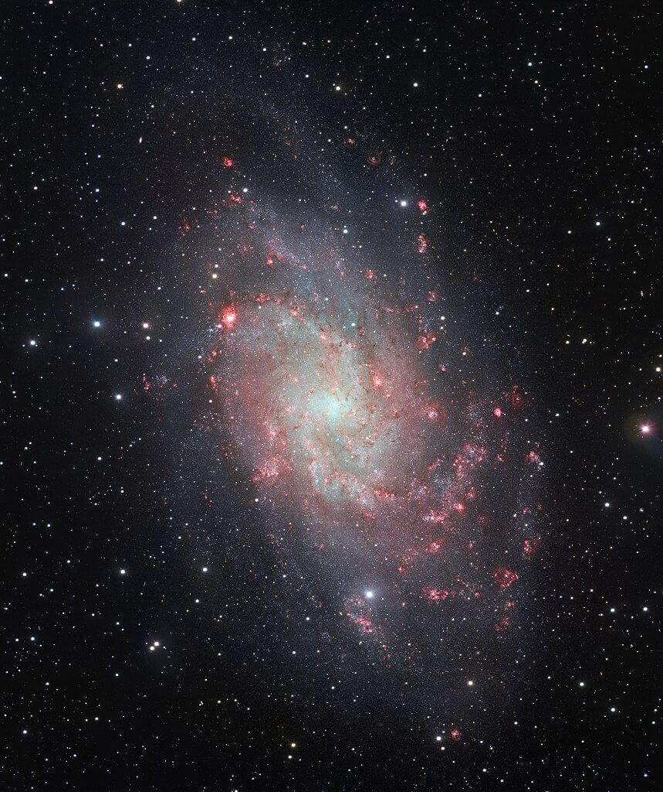

## 8️⃣1️⃣ Triangulum Australe (El triángulo austral)

Es una de las varias constelaciones representadas en la [bandera de Brasil](https://es.wikipedia.org/wiki/Bandera_de_Brasil): 



además de ser el símbolo del movimiento secesionista brasileño [O Sul é o Meu País](https://es.wikipedia.org/wiki/O_Sul_é_o_Meu_País):



## 8️⃣2️⃣ Tucana (El tucán)

En ella se sitúa la mayor parte de la [Pequeña Nube de Magallanes](https://es.wikipedia.org/wiki/Pequeña_Nube_de_Magallanes), la segunda galaxia satélite más grande de la [Vía Láctea](https://es.wikipedia.org/wiki/Vía_Láctea):

.jpg")

## 8️⃣3️⃣ Ursa Major (Osa mayor)

Junto con [Orion](#60-orion-el-cazador), la constelación más famosa. No confundir con [El Carro](https://es.wikipedia.org/wiki/El_Carro_(asterismo)), que es un asterismo de la constelación. Nos sirve como guía para localizar a [Polaris](https://es.wikipedia.org/wiki/Polaris_(estrella)) gracias a sus estrellas [Dubhe](https://es.wikipedia.org/wiki/Dubhe) y [Merak](https://es.wikipedia.org/wiki/Merak), las apuntadoras:

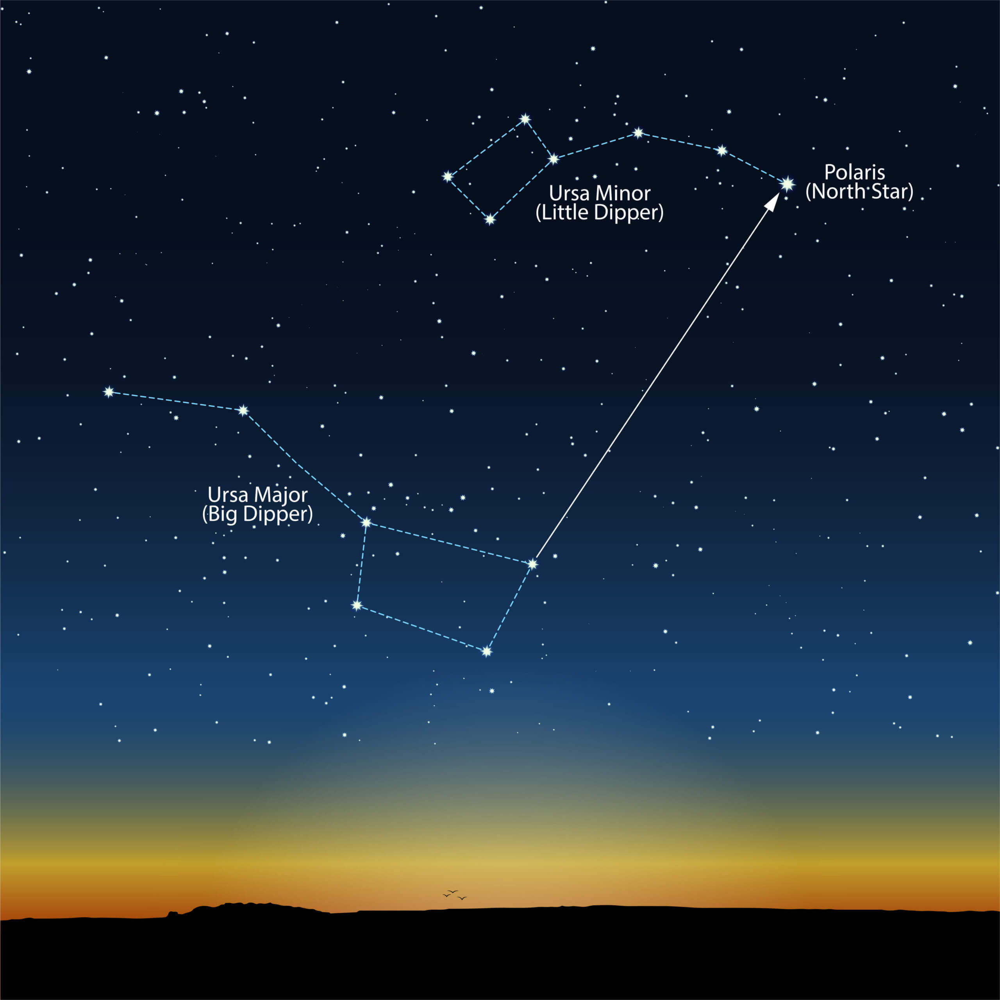

## 8️⃣4️⃣ Ursa Minor (Osa menor)

Es la constelación más boreal. En ella se sitúa [Polaris](https://es.wikipedia.org/wiki/Polaris_(estrella)), nuestra actual [estrella polar boreal](https://es.wikipedia.org/wiki/Estrella_polar), que es la más brillante de la constelación. Su segunda estrella más brillante, [Kochab](https://es.wikipedia.org/wiki/Kochab), también fue (y será) estrella polar:

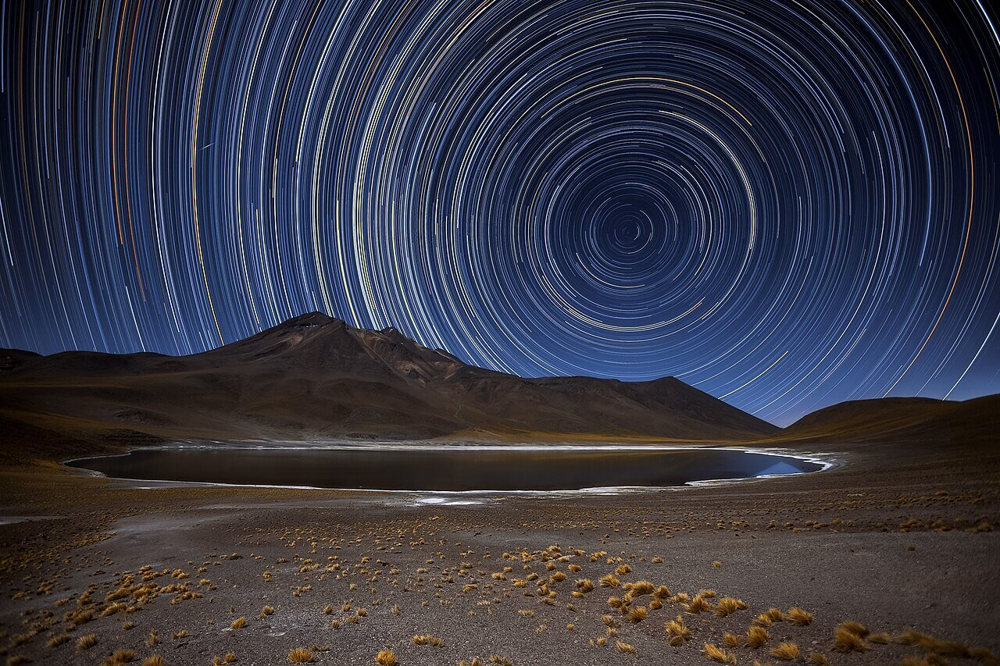

## 8️⃣5️⃣ Vela (La vela)

Es la última de la constelaciones que formaban la ya extinta constelación [Argo Navis](https://es.wikipedia.org/wiki/Argo_Navis), junto con [Carina](#17-carina-la-quilla) y [Puppis](#68-puppis-la-popa). La estrella [Gamma Velorum](https://es.wikipedia.org/wiki/Gamma_Velorum) es la [estrella Wolf-Rayet](https://es.wikipedia.org/wiki/Estrella_de_Wolf-Rayet) más brillante y cercana a la Tierra:

## 8️⃣6️⃣ Virgo (La virgen)

Es la constelación [zodiacal](https://es.wikipedia.org/wiki/Zodiaco) más grande y la segunda más extensa de todo el firmamento, solo por detrás de [Hydra](#42-hydra-la-hidra). El [punto Libra](https://es.wikipedia.org/wiki/Punto_Libra) se localiza actualmente en [Virgo](https://es.wikipedia.org/wiki/Virgo_(constelación)), así como el [cúmulo de galaxias de Virgo](https://es.wikipedia.org/wiki/Cúmulo_de_Virgo), el cúmulo más cercano a la [Vía Láctea](https://es.wikipedia.org/wiki/Vía_Láctea):

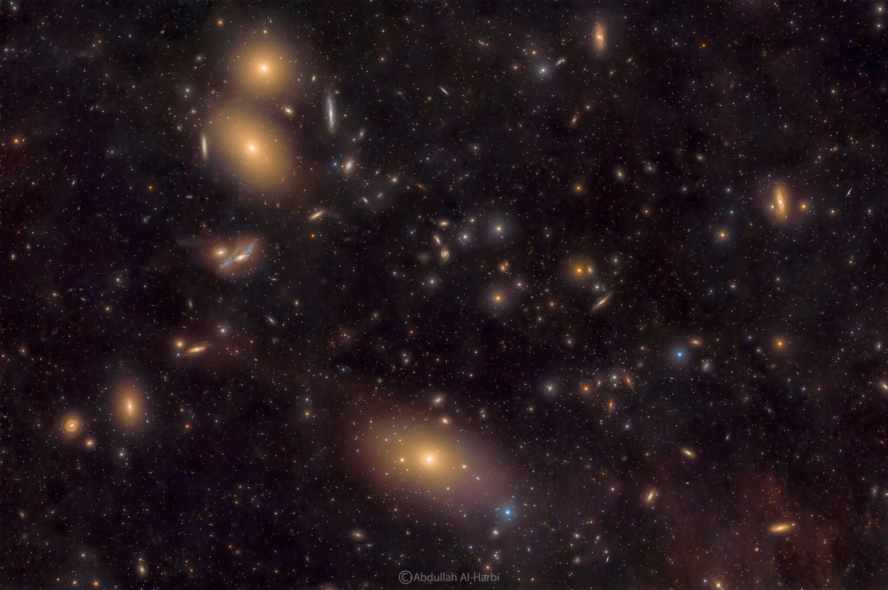

## 8️⃣7️⃣ Volans (El pez volador)

Al igual que [Telescopium](#79-telescopium-el-telescopio), bastante sosa. Es la otra constelación que aparece junto con [Hydrus](#43-hydrus-la-hidra-macho) en [Moby Dick](https://es.wikipedia.org/wiki/Moby_Dick).

## 8️⃣8️⃣ Vulpecula (La raposa)

La última de todas. En ella [Jocelyn Bell](https://es.wikipedia.org/wiki/Jocelyn_Bell_Burnell) descubrió el primer [púlsar](https://es.wikipedia.org/wiki/Púlsar) en 1967, al que llamó [LGM-1](https://es.wikipedia.org/wiki/PSR_B1919%2B21) (Little Green Men-1):

Es también hogar de la famosa [nebulosa Dumbbell (M27)](https://es.wikipedia.org/wiki/Nebulosa_Dumbbell), una nebulosa planetaria muy estudiada en la literatura:

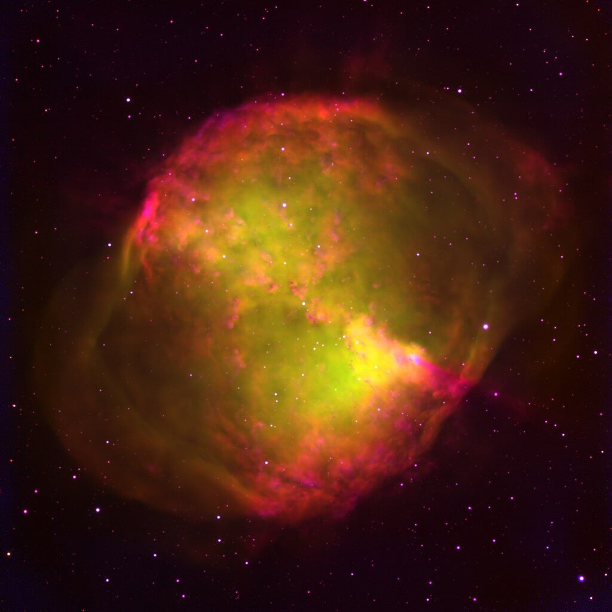